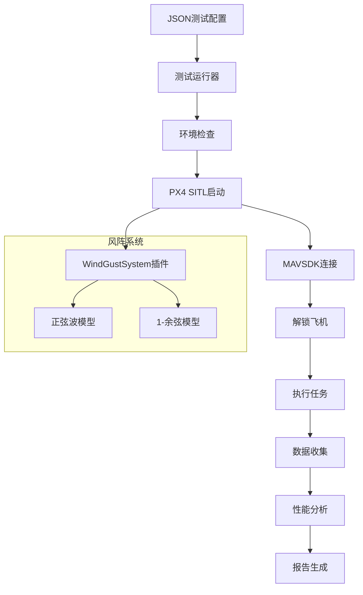

# PX4 风阵评估框架

一个用于评估PX4倾转旋翼机在各种风阵条件下性能的综合测试框架，使用软件在环（SITL）仿真。

## 🎯 功能特点

- **自动化测试**: 自动启动PX4 SITL、执行任务、分析结果
- **JSON配置驱动**: 灵活的测试场景定义
- **多种风阵模型**: 支持正弦波和1-余弦阵风模型
- **实时数据收集**: 收集位置、速度、姿态等飞行数据
- **性能分析**: 自动计算偏差、误差等性能指标
- **详细报告**: 生成JSON格式的测试报告

## 🏗️ 架构图



## 🚀 快速开始

### 1. 环境检查

```bash
cd Tools/px4_gust_eval
uv run setup_environment.py --check-only
```

### 2. 运行基本测试

```bash
# 运行基础验证测试（推荐首次使用）
uv run main.py tasks/basic_validation_tests.json --verbose

# 运行示例风阵测试
uv run main.py tasks/example_gust_tests.json --verbose

# 运行恶劣天气测试
uv run main.py tasks/severe_weather_tests.json --verbose
```

## 📋 测试配置

### 配置文件结构

测试配置采用JSON格式，包含以下主要部分：

```json
{
  "test_suite": "测试套件名称",
  "description": "测试套件描述",
  "px4_sitl_command": "make px4_sitl gz_tiltrotor_windy",
  "mission_config": {
    "takeoff_altitude": 20.0,
    "waypoints": [
      {"lat": 47.397742, "lon": 8.545594, "alt": 20.0},
      {"lat": 47.398242, "lon": 8.546094, "alt": 20.0}
    ],
    "airspeed": 12.0,
    "timeout_sec": 90
  },
  "wind_gust_tests": [
    {
      "test_id": "test_example",
      "description": "测试描述",
      "wind_config": {
        "model": "sine",
        "mean": [5.0, 0.0, 0.0],
        "amplitude": [2.0, 1.0, 0.5],
        "frequency": 0.1,
        "phase": 0.0
      }
    }
  ]
}
```

如果需要在 QGroundControl 中为固定翼（或任意类型）规划完整任务，只需在 `mission_config` 中提供 `.plan` 文件路径：

```json
"mission_config": {
  "plan_file": "missions/fixedwing_box.plan",
  "timeout_sec": 420,
  "rtl_after_mission": true,
  "post_mission_wait_sec": 30,
  "mission_start_attempts": 2,
  "min_mission_runtime_sec": 8.0
}
```

`plan_file` 支持相对（相对于任务配置 JSON）或绝对路径。simple_runner 会自动导入任务、上传到 PX4 并执行 `start mission`，`timeout_sec` 控制任务必须完成的时间窗口，`post_mission_wait_sec` 用于任务结束后等待飞机降落/解锁的时间。若保留旧字段（如 `takeoff_altitude`、`waypoints`），将继续执行默认的起飞→前飞→降落逻辑。

固定翼 SITL 经常需要两次 `start mission` 才会真正进入任务，因此 `mission_start_attempts`（或向后兼容的 `mission_start_retries`）默认值为 2，可按需增减。`min_mission_runtime_sec` 用来判断“假启动”——如果第一次任务在该时间前完成且没有实际起飞/航点进度，simple_runner 会自动重启任务。通过这些选项，无需手动在 QGC 连续点击两次。

### ULog 后处理/绘图

simple_runner 在每个测试结束后会调用 `postprocess_ulog.py`：

- 自动查找 `build/px4_sitl_default/rootfs/log/<日期>/<时间>` 下最新 `.ulg`，提取 `trajectory_setpoint`/`vehicle_local_position_setpoint`。
- 将轨迹期望（经纬度/高度/局部坐标）写入 `run_*/<test_id>.csv`，新增 `traj_sp_*`、`track_err_*` 列，可供二次分析。
- 输出两张图：`*_path.png`（实际 vs 任务航迹）、`*_tracking_error.png`（水平/垂直误差随时间），方便快速验证。

脚本也可以独立运行，例如：

```bash
python Tools/px4_gust_eval/postprocess_ulog.py \
  --run-dir Tools/px4_gust_eval/logs/basic_validation/run_20251229_112933 \
  --test-id no_wind_baseline \
  --log-root build/px4_sitl_default/rootfs/log
```

或直接指定单个文件：

```bash
python Tools/px4_gust_eval/postprocess_ulog.py \
  --csv run_xxx/no_wind_baseline.csv \
  --ulog build/px4_sitl_default/rootfs/log/2025-12-29/11_29_33.ulg
```

可通过 `--no-plots`、`--tolerance`、`--time-offset` 控制对齐策略。
同时，`plot_gust_levels.py` 会优先使用这些 `track_err_*` 列计算 `h_max_dev_*`/`v_max_dev_*`，确保条形图展示真实的轨迹偏差，而非固定距离的近似。

### 风阵模型配置

#### 正弦波模型
适用于周期性风变化：
```json
{
  "model": "sine",
  "mean": [x_ms, y_ms, z_ms],        // 平均风速 (m/s)
  "amplitude": [x_amp, y_amp, z_amp], // 振幅 (m/s)
  "frequency": 0.1,                   // 频率 (Hz)
  "phase": 0.0                        // 相位 (弧度)
}
```

#### 1-余弦阵风模型
基于航空标准的阵风模型：
```json
{
  "model": "one_minus_cos",
  "mean": [x_ms, y_ms, z_ms],    // 平均风速 (m/s)
  "gust_length": 50.0,           // 阵风长度 (m)
  "airspeed": 15.0,              // 空速 (m/s)
  "direction": [1.0, 0.5, 0.0],  // 阵风方向
  "phase": 0.0                   // 相位偏移 (弧度)
}
```

## 📊 输出和结果

### 输出目录结构
```
logs/
├── gust_eval_20231225_143022/
│   ├── test_results.json          # 测试结果汇总
│   ├── flight_data_test1.json     # 飞行数据
│   └── console_output.log         # 控制台日志
```

### 性能指标

框架自动计算以下性能指标：

1. **位置精度**
   - 最大位置误差 (m)
   - 航迹偏差统计
   - 高度偏差

2. **任务性能**
   - 任务完成状态
   - 总任务持续时间
   - 航点到达时间

3. **飞行特性**
   - 空速变化
   - 姿态偏差（滚转、俯仰、偏航）

## 🛠️ 故障排除

### 常见问题

1. **PX4 SITL无法启动**
   ```bash
   # 检查是否已有px4进程运行
   killall px4

   # 确保构建完成
   make px4_sitl_default
   ```

2. **MAVSDK连接超时**
   - 验证PX4正在运行并接受连接
   - 检查MAVLink端口（通常是14540）
   - 确保没有防火墙阻拦

3. **飞机解锁失败**
   - 等待GPS锁定
   - 检查预飞检查状态
   - 框架会自动设置宽松的解锁参数

### 调试模式

```bash
# 启用详细日志
uv run main.py tasks/debug_tests.json --verbose

# 运行简单连接测试
uv run simple_test.py
```

## 📈 测试套件

### 1. 基础验证测试 (`basic_validation_tests.json`)
- **目的**: 验证框架功能
- **测试**: 无风、恒定轻风、温和变化
- **时长**: ~15分钟
- **用例**: 初始验证、回归测试

### 2. 示例阵风测试 (`example_gust_tests.json`)
- **目的**: 标准风阵评估
- **测试**: 各种正弦和1-余弦阵风模式
- **时长**: ~45分钟
- **用例**: 常规性能评估

### 3. 恶劣天气测试 (`severe_weather_tests.json`)
- **目的**: 极端条件测试
- **测试**: 高强度阵风、侧风、垂直阵风
- **时长**: ~60分钟
- **用例**: 鲁棒性测试、认证支持

## 🔧 开发和扩展

### 添加新测试场景

1. 在 `tasks/` 中创建新的JSON配置文件
2. 定义风模式和任务参数
3. 设置适当的预期结果阈值
4. 在运行完整套件之前先测试小子集

### 扩展风模型

1. 修改 `WindGustSystem.cpp` 添加新的阵风模式
2. 更新配置解析器以处理新参数
3. 添加相应的JSON架构验证
4. 更新文档和示例

## 📝 项目文件结构

```
px4_gust_eval/
├── main.py                    # 主入口点
├── gust_test_runner.py        # 核心框架（~600行）
├── setup_environment.py       # 环境设置和验证
├── simple_test.py            # 简单连接测试
├── tasks/                    # 测试配置文件
│   ├── basic_validation_tests.json
│   ├── example_gust_tests.json
│   ├── severe_weather_tests.json
│   └── quick_test.json
├── logs/                     # 输出目录
├── requirements.txt          # Python依赖
├── pyproject.toml           # 项目配置
└── README_CN.md             # 中文文档
```

## ✨ 成功案例

经过调试验证，框架已成功实现：

- ✅ **环境自动检查**: 完全正常
- ✅ **PX4 SITL启动**: 成功启动tiltrotor windy模型
- ✅ **MAVSDK连接**: 连接正常，遥测数据流正常
- ✅ **自动解锁**: 成功解锁（通过参数设置）
- ✅ **自动起飞**: 成功起飞到目标高度（10+米）
- ✅ **自动降落**: 成功降落
- ✅ **数据收集**: 实时收集位置、速度、姿态数据
- ✅ **报告生成**: 生成详细的JSON测试报告

## 🤝 贡献

欢迎贡献代码和改进建议：

1. Fork 仓库
2. 创建功能分支
3. 实现更改并添加测试
4. 更新文档
5. 提交拉取请求

## 📄 许可证

本项目采用BSD 3-Clause许可证 - 详见PX4项目许可证。

---

*由PX4风阵评估框架v0.1.0生成*

## 快速测试命令

```bash
# 基础功能测试
cd Tools/px4_gust_eval
uv run simple_test.py

# 完整测试流程
uv run main.py tasks/basic_validation_tests.json --verbose
```
